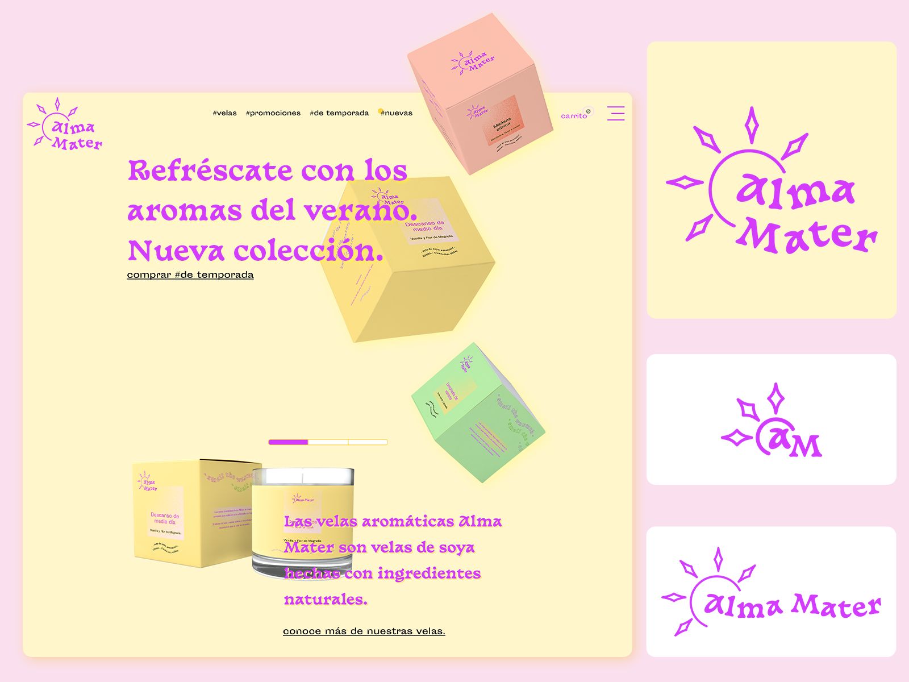
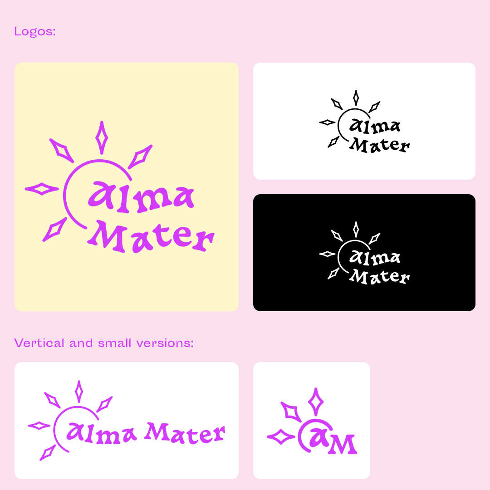
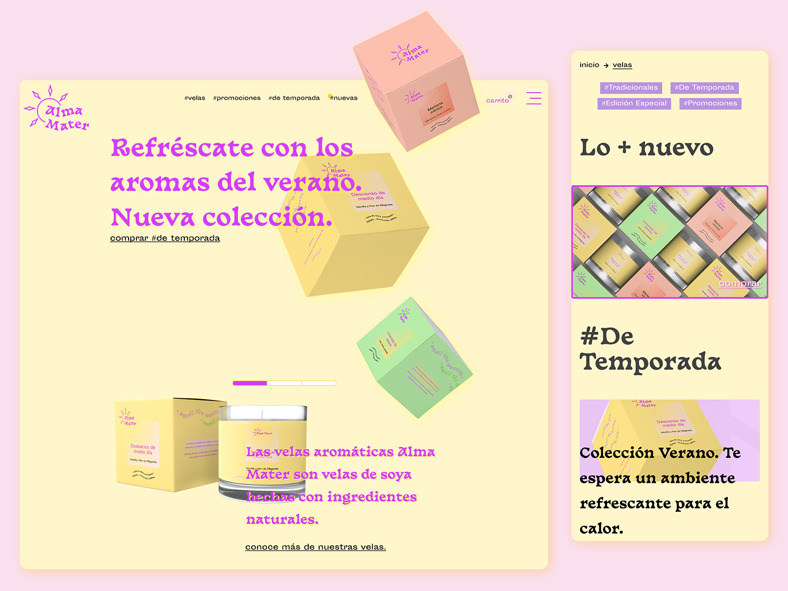
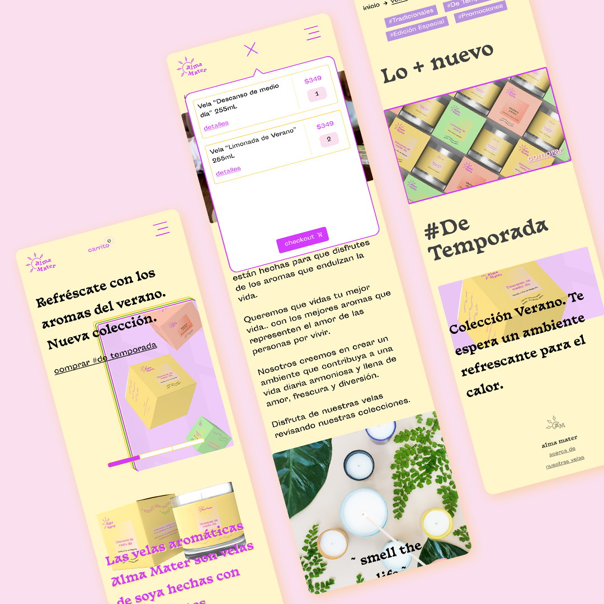

<section className="description">

### Descripción

Alma Mater es una marca ficticia de velas aromáticas de soya naturales. Nació como un proyecto del sitio Dribbble por su reto semanal "Weekly Challenge", donde se instruyó elaborar una marca moderna de velas aromáticas.

Alma Mater valora el estilo de vida armonioso y lleno de vida y diversión que buscan las personas, que vivan su vida al máximo, balanceando entre la tranquilidad, el trabajo y disfrutar.

</section>

<section className="details">

### Detalles

<dl>
  <dt> Cliente: </dt>
  <dd> Proyecto ficticio personal. </dd>
  <dt> Producto: </dt>
  <dd> Velas Aromáticas. </dd>
  <dt> Objetivos: </dt>
  <dd> Transmitir a la audiencia una marca de velas con la que se identifiquen.
 </dd>
</dl>
<dl>
  <dt> Tipo: </dt>
  <dd> Hogar. </dd>
  <dt> Propuesta de venta: </dt>
  <dd>
    Es un producto con aromas que revitalizan y atribuyen un ambiente refrescante a los hogares.
  </dd>
  <dt> Rol: </dt>
  <dd> Diseño gráfico, web, branding y packaging. </dd>
</dl>

</section>

<section className="process">

### Proceso

Brief -> Investigación y Estrategia -> Imaginación -> Propuesta de diseño

</section>

<section className="brief">

## 1 Brief

Elaboré un brief pequeño con la información más importante de la marca.

<dl>
<dt>Público Objetivo</dt>
<dd>Mujeres de 28-48 años, mexicanas, clase media, media-alta, alta.</dd>
<dt>Solución de Diseño</dt>
<dd>Logotipo de marca.</dd>
<dd>Packaging.</dd>
<dd>Sitio web.</dd>
</dl>

</section>

<section className="research-and-strategy">

## 2 Investigación y Estrategia

Desde aquí, elaboré un texto descriptor con el mensaje y lo más importante conceptualmente para la marca, para luego definir palabras de identidad y luego claves de identidad que ayudan a poner gráficamente los conceptos clave de la identidad: **dulce, armonía, refrescante, vida**.

</section>

<section className="imagination">

## 3 Imaginación

Aquí surgen las ideas que serán pasadas a digital, con base en las palabras clave de identidad y sus posibles descriptores gráficos.

</section>

<section className="proposal">

## 4 Propuesta

Con la propuesta toman forma todos los pasos anteriores en el branding final, decidí ir con los colores morado como principal para denotar la vida, con amarillo como secundario, que refleja el sol y su brillo que da vida.

La tipografía es "Basteleur", con letras con formas curvas que denotan creatividad y diversión. El símbolo del logo como sol denota la vida, y las curvas de el nombre "Alma Mater" simbolizan los rayos del sol que ondulan a la tierra.

Gracias por ver este proyecto!

</section>