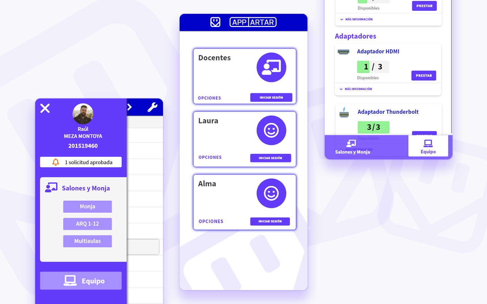
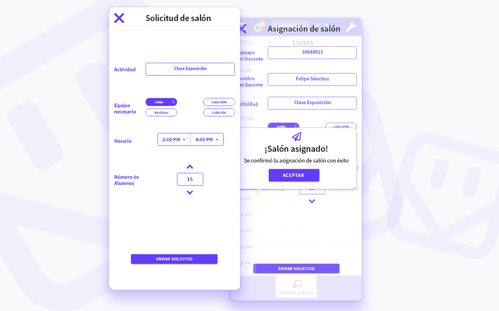

<section className="description">

### Descripción

El concepto de aplicación móvil APPARTAR nació por un proyecto universitario, es una aplicación que ayuda a los docentes y administrativos a apartar salones de clase, sin conflictos de horario ya que está conectada a una base de datos.

 

Realicé el concepto por una clase de Diseño de Interfaces, para ofrecer un vistazo a cómo sería una herramienta amigable y útil para las universidades y colegios en general.

</section>

<section className="details">

 

### Detalles

<dl>
  <dt> Cliente: </dt>
  <dd> Proyecto Universitario. </dd>
  <dt> Producto: </dt>
  <dd> Concepto de aplicación móvil. </dd>
  <dt> Objetivos: </dt>
  <dd> Diseñar una aplicación móvil para el apartado de salones de clase, amigable y fácil de usar para cualquier docente o administrativo en un amplio rango de edades. </dd>
</dl>
<dl>
  <dt> Tipo: </dt>
  <dd> Aplicación Móvil. </dd>
  <dd> Diseño UX/UI. </dd>
  <dt> Rol: </dt>
  <dd> Diseño gráfico, interfaz y experiencia de usuario. </dd>
</dl>

</section>