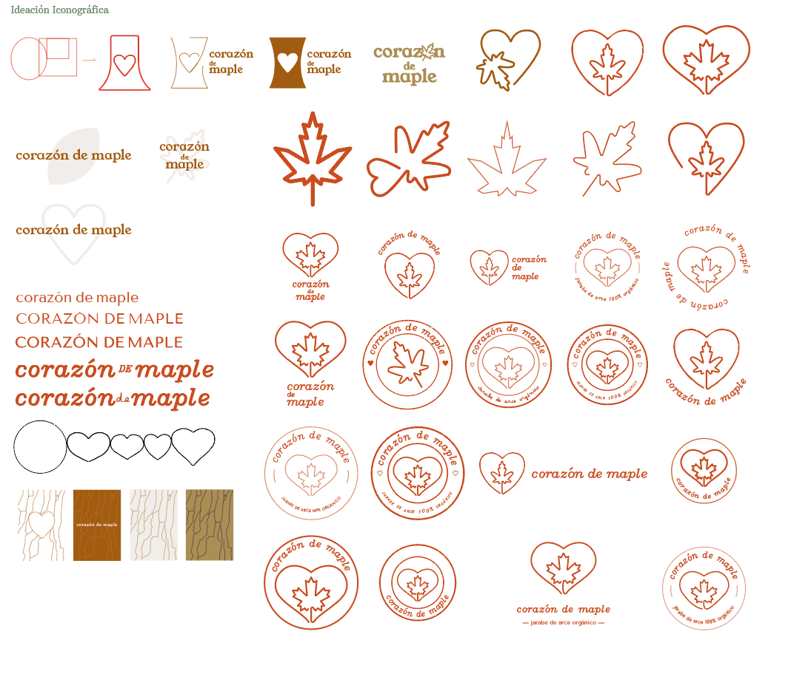
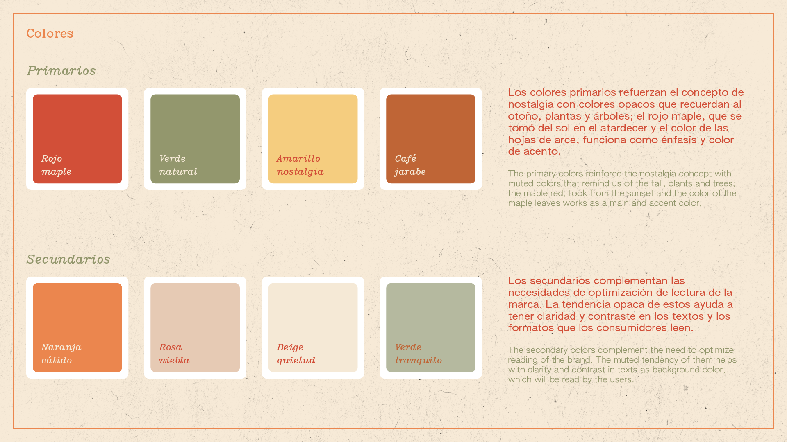

### Descripción

Corazón de Maple es un proyecto de branding que empezó como una tarea universitaria para crear una marca y empaque para un producto líquido.

Su meta es inspirar a la gente y sus familias a consumir jarabe de arce nacional, para mejorar su vida y agregarle dulzura nostálgica.

Los elementos simples y nostálgicos, mezclados con las gráficas y los colores añaden al ambiente de la marca, usando tipografía serif tradicional mezclada con sans-serif, colores cálidos y textura de papel para crear sentimiento de calidez y remembranza.

### Detalles

- Cliente:
  - Proyecto ficticio personal.
- Producto:
  - Jarabe de arce.
- Objetivos:
  - Crear una marca memorable y nostálgica.
- Tipo:
  - Comida.
- Propuesta de venta:
  - Es un producto mexicano y orgánico que tiene una marca memorable visual y conceptualmente.
- Rol:
  - Diseño gráfico y de producto.

### Proceso

Brief -> Investigación y Estrategia -> Imaginación -> Propuesta de diseño

## 1 Brief

Primero, se realizó un brief con la información más importante del negocio, el producto, y el cliente para poder comenzar el proceso de diseño: los objetivos, resultados esperados, productos finales, palabras clave, etc., lo cual minimiza malentendidos y acelera el proceso!

#### ¿Quién?

Tamaño mediano, empresa relacionada con comida (jarabe de arce)

#### ¿Qué?

Identidad de marca, branding, empaque y sitio para presencia en línea.

#### ¿Por qué?

Incrementar memorabilidad y volverse el producto #1 de jarabe de arce del país.

#### ¿Cuándo?

Un mes para el proceso de diseño.

#### ¿Dónde?

Digital, presencia en línea.

## 2 Investigación y Estrategia

Con base en el brief, se investiga todo lo posible acerca del negocio, consumidores, el mercado y competidores. Se decide y se comunica al cliente los **aspectos clave** del branding.

## 3 Imaginación

Usando la investigación y los valores de marca, se **generan palabras clave**, divididas en **sustantivos**, **adjetivos** y **colores**; luego correlacionándolos con formas, colores, atmósferas, etc., que puedan ser comunicadas gráficamente.

Decidí quedarme con el corazón y la icónica hoja de maple para aprovechar la **memorabilidad** de ambos íconos en el público meta, así, las familias enteras verán la marca y podrán reconocer los íconos y relacionarlos con sentimientos positivos y cálidos por la familiaridad de estos.

## 4 Propuesta

Aquí se deciden cuáles con los colores, logos y tipografía que se usarán, tanto en la identidad como en el manual, sitio web, posible publicidad, etc.

Finalmente, decidí utilizar un mockup 3D que comunicara lo que es el producto, y mostrarlo en un ambiente abstracto lo enfatiza; así como un mockup del sitio web y gráficas complementarias que mostrarían cómo se verían posibles anuncios para tener una vista amplia del branding final!

