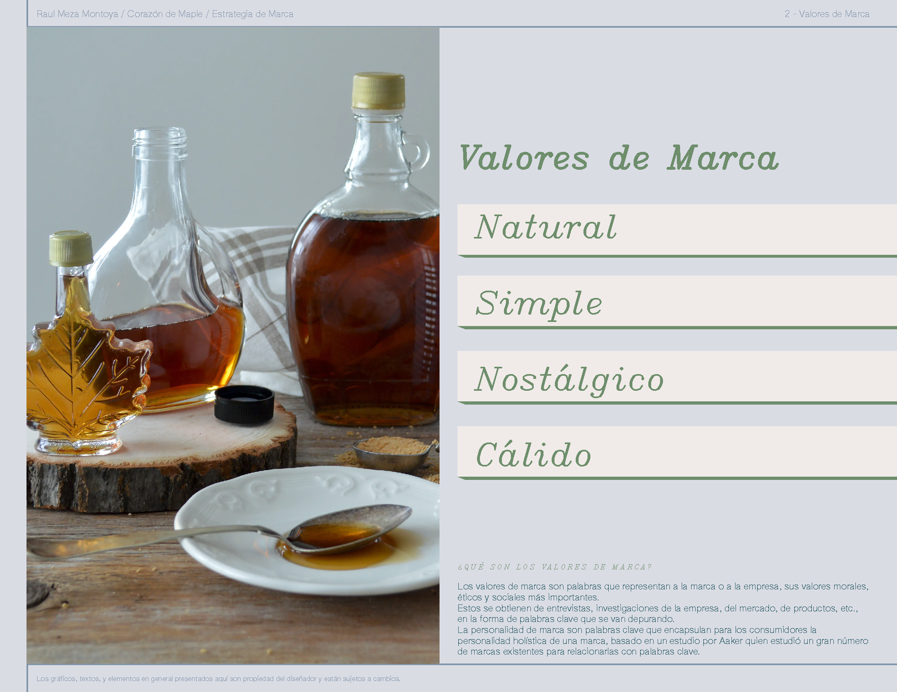
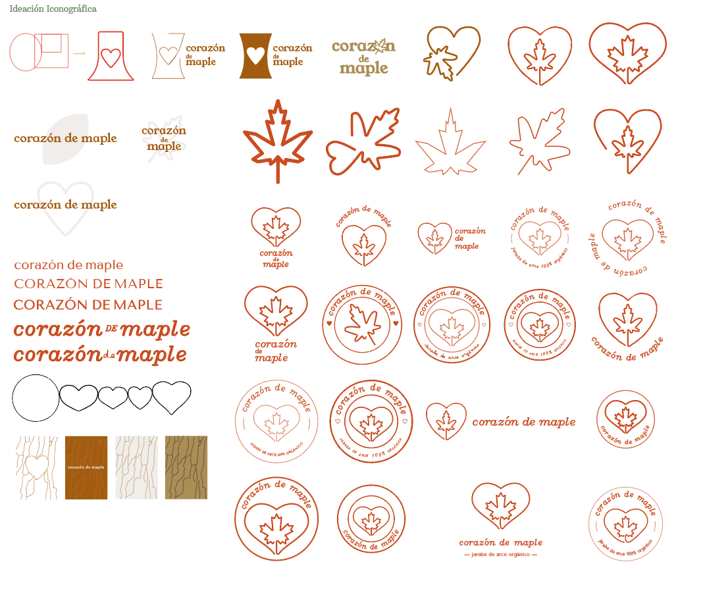
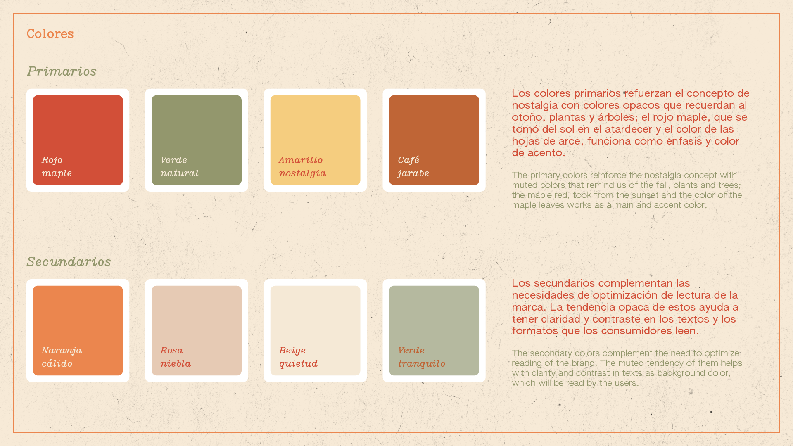
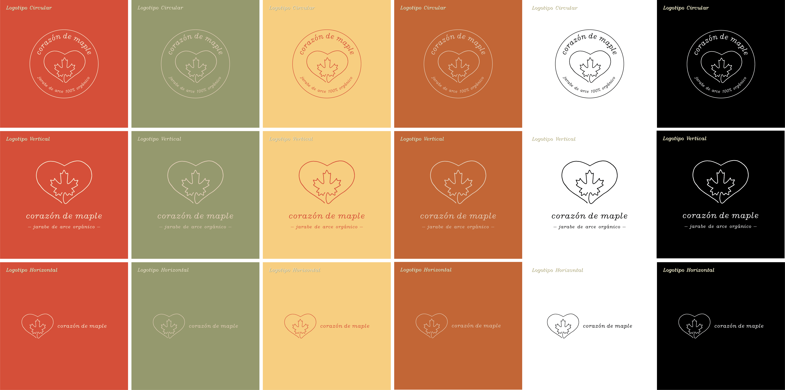
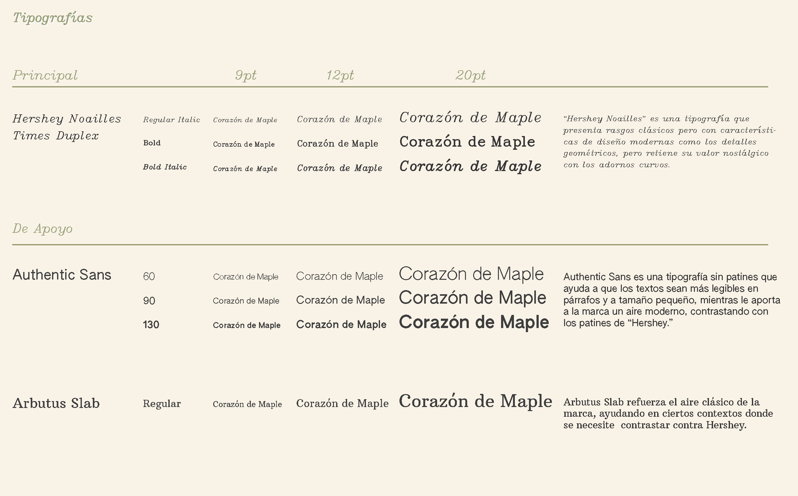
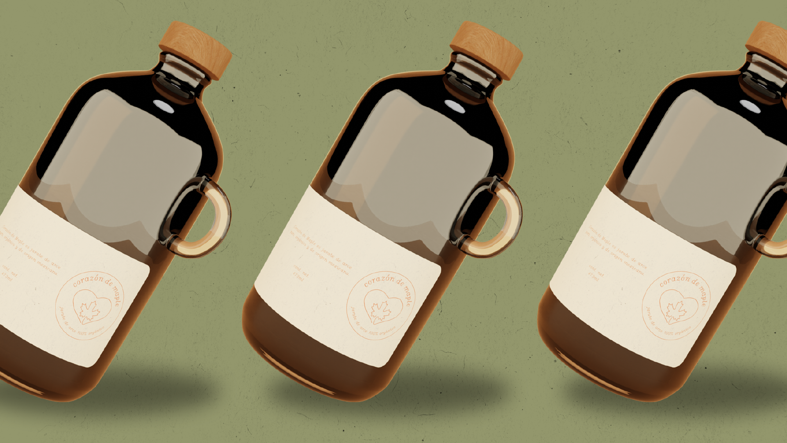
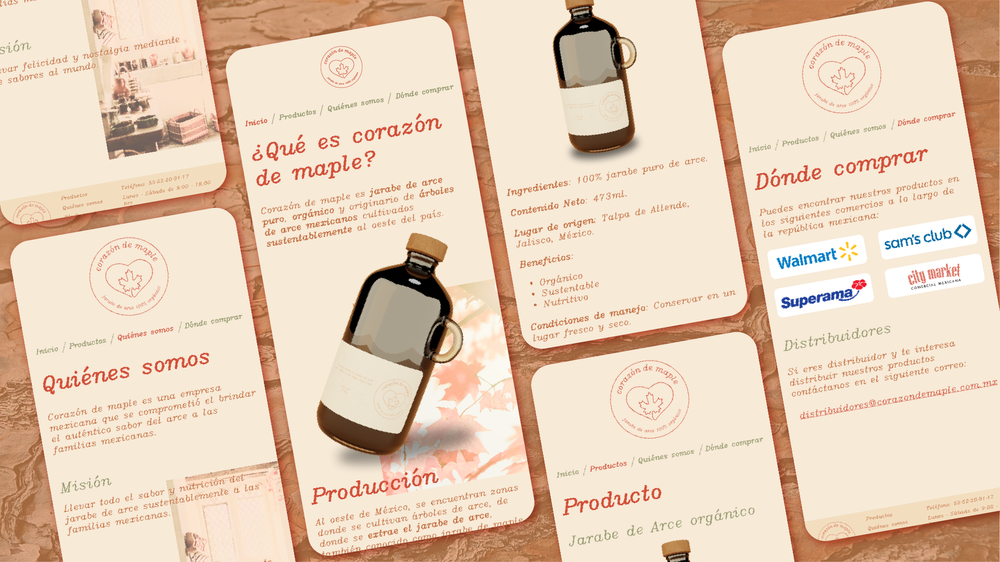
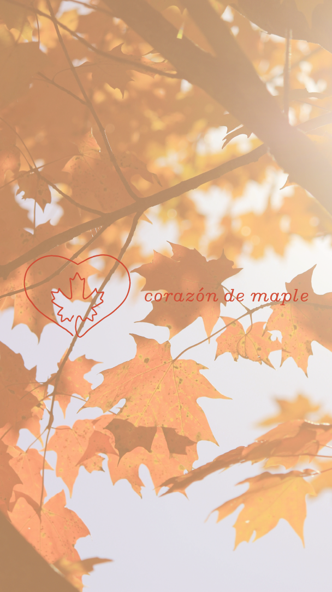

<section className="description">

### Descripción

Corazón de Maple es un proyecto de branding que empezó como una tarea universitaria para crear una marca y empaque para un producto líquido.

Su meta es inspirar a la gente y sus familias a consumir jarabe de arce nacional, para mejorar su vida y agregarle dulzura nostálgica.

Los elementos simples y nostálgicos, mezclados con las gráficas y los colores añaden al ambiente de la marca, usando tipografía serif tradicional mezclada con sans-serif, colores cálidos y textura de papel para crear sentimiento de calidez y remembranza.

</section>

<section className="details">

### Detalles

<dl>
  <dt> Cliente: </dt>
  <dd> Proyecto ficticio personal. </dd>
  <dt> Producto: </dt>
  <dd> Jarabe de arce. </dd>
  <dt> Objetivos: </dt>
  <dd> Crear una marca memorable y nostálgica. </dd>
</dl>
<dl>
  <dt> Tipo: </dt>
  <dd> Comida. </dd>
  <dt> Propuesta de venta: </dt>
  <dd>
    {" "}
    Es un producto mexicano y orgánico que tiene una marca memorable visual y conceptualmente.{" "}
  </dd>
  <dt> Rol: </dt>
  <dd> Diseño gráfico y de producto. </dd>
</dl>

</section>

<section className="process">

### Proceso

Brief -> Investigación y Estrategia -> Imaginación -> Propuesta de diseño

</section>

<section className="brief">

## 1 Brief

Primero, se realizó un brief con la información más importante del negocio, el producto, y el cliente para poder comenzar el proceso de diseño: los objetivos, resultados esperados, productos finales, palabras clave, etc., lo cual minimiza malentendidos y acelera el proceso!

<dl>
<svg id="brief-arrows"
  width="56px"
  height="100%"
  viewBox="0 0 56 424"
  fill="none"
  xmlns="http://www.w3.org/2000/svg">
  <path d="M21 48V408" stroke="black" />
  <path
    d="M21.8 422.933L31.8 409.6C32.2944 408.941 31.824 408 31 408L11 408C10.176 408 9.70557 408.941 10.2 409.6L20.2 422.933C20.6 423.467 21.4 423.467 21.8 422.933Z"
    stroke="black"
  />
  <path
    d="M55.0239 47.2191L42.6247 37.2998C41.9699 36.7759 41 37.2421 41 38.0806L41 57.9194C41 58.7579 41.9699 59.2241 42.6247 58.7002L55.0239 48.7809C55.5243 48.3805 55.5243 47.6195 55.0239 47.2191Z"
    stroke="black"
  />
  <path d="M41 48H3C1.89543 48 1 47.1046 1 46L1 0" stroke="black" />
</svg>
  <dt>¿Quién?</dt>
  <dd>Tamaño mediano, empresa relacionada con comida (jarabe de arce)</dd>

  <dt>¿Qué?</dt>
  <dd>Identidad de marca, branding, empaque y sitio para presencia en línea.</dd>

  <dt>¿Por qué?</dt>
  <dd>Incrementar memorabilidad y volverse el producto #1 de jarabe de arce del país.
  </dd>

  <dt>¿Cuándo?</dt>
  <dd>Un mes para el proceso de diseño.</dd>

  <dt>¿Dónde?</dt>
  <dd>Digital, presencia en línea.</dd>
</dl>

</section>

<section className="research-and-strategy">

## 2 Investigación y Estrategia

Con base en el brief, se investiga todo lo posible acerca del negocio, consumidores, el mercado y competidores. Se decide y se comunica al cliente los **aspectos clave** del branding.

</section>

<section className="imagination">

## 3 Imaginación

Usando la investigación y los valores de marca, se **generan palabras clave**, divididas en **sustantivos**, **adjetivos** y **colores**; luego correlacionándolos con formas, colores, atmósferas, etc., que puedan ser comunicadas gráficamente.

Decidí quedarme con el corazón y la icónica hoja de maple para aprovechar la **memorabilidad** de ambos íconos en el público meta, así, las familias enteras verán la marca y podrán reconocer los íconos y relacionarlos con sentimientos positivos y cálidos por la familiaridad de estos.

</section>

<section className="proposal">

## 4 Propuesta

Aquí se deciden cuáles con los colores, logos y tipografía que se usarán, tanto en la identidad como en el manual, sitio web, posible publicidad, etc.

Finalmente, decidí utilizar un mockup 3D que comunicara lo que es el producto, y mostrarlo en un ambiente abstracto lo enfatiza; así como un mockup del sitio web y gráficas complementarias que mostrarían cómo se verían posibles anuncios para tener una vista amplia del branding final!

</section>

