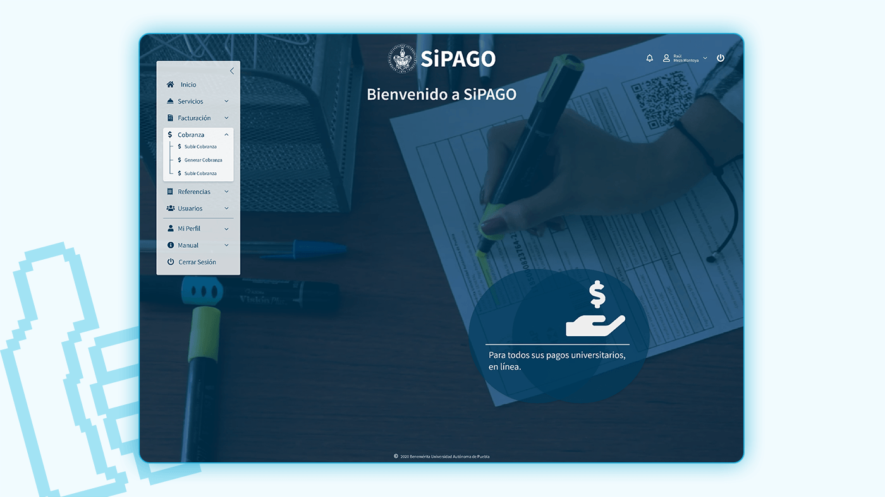
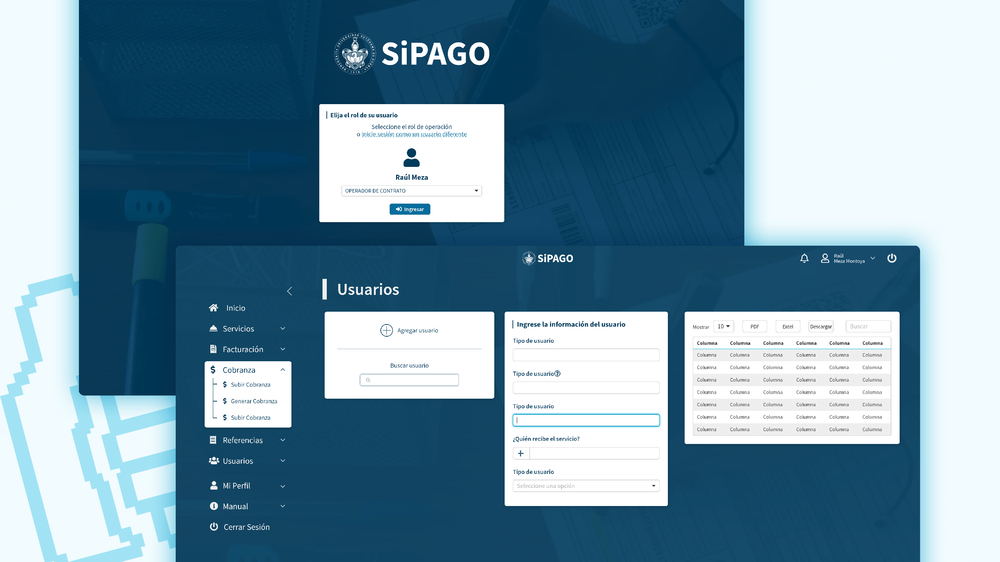

<section className="description">

### Descripción

SiPAGO es un sistema de pagos para diversos servicios de la Benemérita Universidad Autónoma de Puebla (BUAP); desde pago de servicios escolares, hasta pago de eventos y cursos para la comunidad BUAP y de la ciudad de Puebla en general.

Se tomó como base el sistema AdminLTE que manejaban en el área de cómputo de la BUAP. Rediseñé la interfaz para que tuviera su propia identidad basado en los elementos claves ya establecidos de los demás sitios web de la BUAP.

Esto fue realizado como parte de el Servicio Social y Prácticas Profesionales que realicé en el departamento de Cómputo de la BUAP (DCyTIC).

</section>

<section className="details">

### Detalles

<dl>
  <dt> Cliente: </dt>
  <dd> Dirección General de Cómputo y Tecnologías de la Información y Comunicaciones. </dd>
  <dt> Producto: </dt>
  <dd> Diseño de interfaz del sitio SiPAGO. </dd>
  <dt> Objetivos: </dt>
  <dd> Rediseñar el sistema SiPAGO para ser más amigable con el usuario, con base en la identidad ya existente en los sitios web de la BUAP. </dd>
</dl>
<dl>
  <dt> Tipo: </dt>
  <dd> Sitio Web. </dd>
  <dd> Diseño UX/UI. </dd>
  <dt> Rol: </dt>
  <dd> Diseño gráfico, interfaz y experiencia de usuario. </dd>
</dl>

</section>